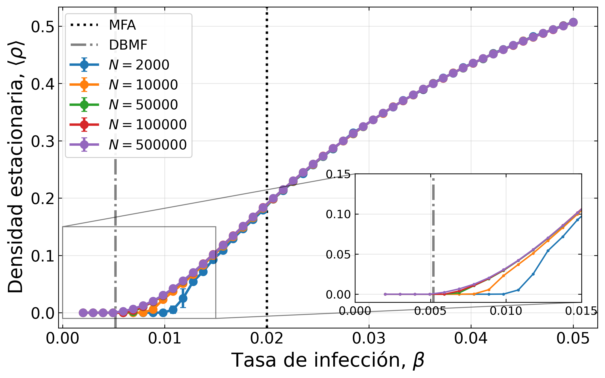
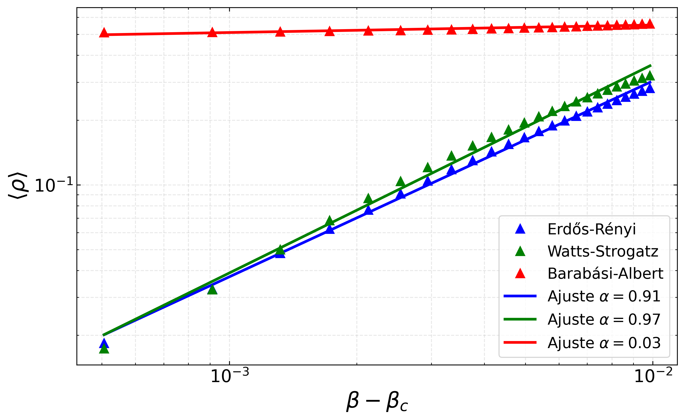
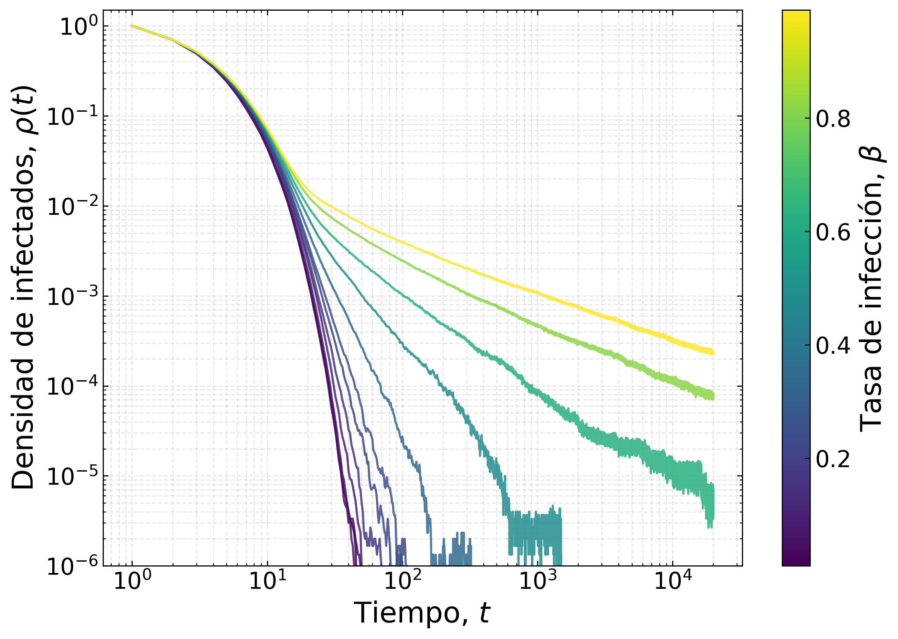
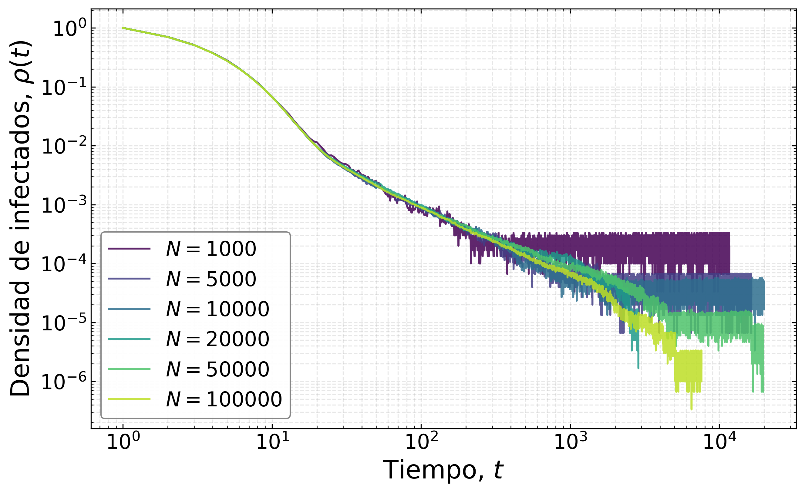
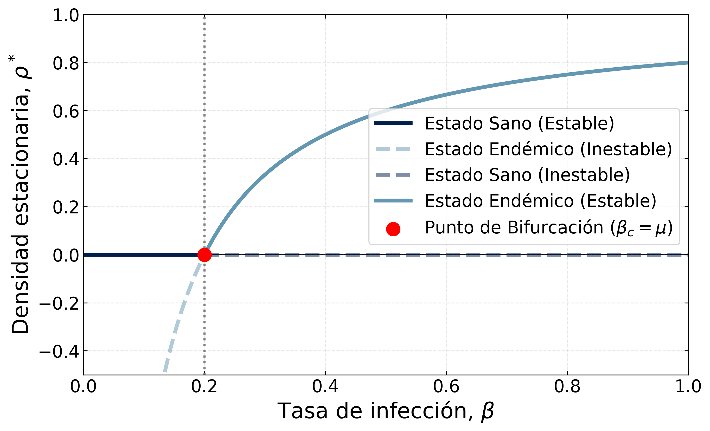
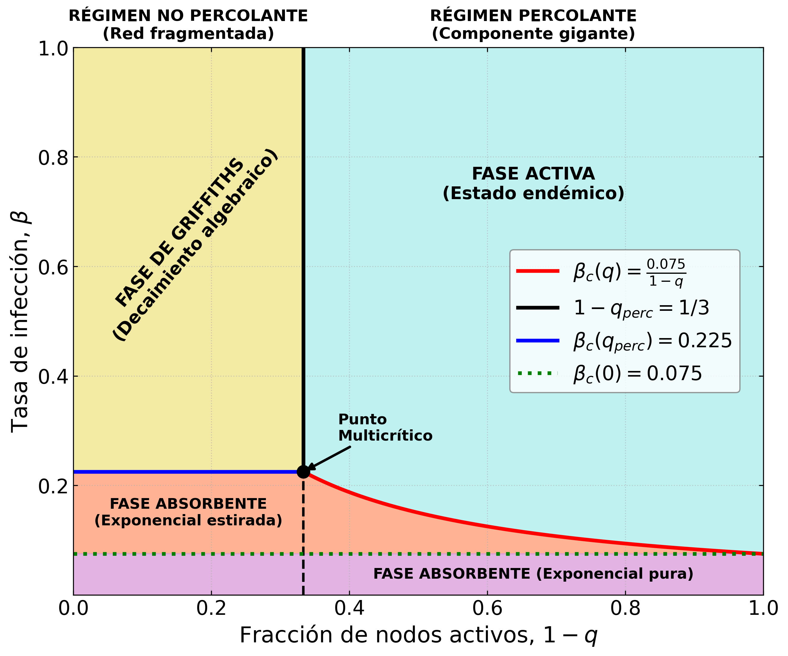

# SIS Dynamics on Complex Networks

> Computational study of epidemic phase transitions, finite-size scaling and Griffiths phases in heterogeneous networks.


<p align="center">
  
  
  <br>
  
  
</p>

---

## Overview

This project investigates the critical behaviour of the **Susceptible–Infected–Susceptible (SIS)** model on complex networks through a combination of analytical methods and large-scale numerical simulations.

While originally motivated by epidemic spreading, the SIS model is also one of the fundamental models of **non-equilibrium statistical physics**, exhibiting a continuous phase transition that belongs to the **Directed Percolation universality class**.

The main objective of this work is to study how **network topology** and **quenched disorder** affect the epidemic threshold and the critical properties of the system.

The project combines:

- Analytical Mean-Field approaches.
- Degree-Based Mean-Field approximations.
- Stochastic simulations on complex networks.
- Finite-size scaling analysis.
- Critical exponent estimation.
- Griffiths phase characterization.
- Extensible disorder modelling.

---

## Scientific Motivation

The SIS model describes diseases in which infected individuals recover without acquiring immunity, allowing reinfection.

For sufficiently small infection rates, the disease eventually disappears. Above a critical threshold, however, the epidemic reaches an active stationary state and persists indefinitely.

This transition constitutes a paradigmatic example of a non-equilibrium phase transition and provides a powerful framework for studying universal critical phenomena on complex networks.

The project explores two complementary questions:

1. How does network topology modify the epidemic threshold and critical behaviour?
2. How does quenched disorder influence the transition and lead to the emergence of Griffiths phases?

---

# Part I — Topological Effects on SIS Dynamics

The first part of the project focuses on understanding how different network structures affect epidemic spreading.

### Network Models

The SIS process is simulated on several classes of complex networks:

#### Erdős–Rényi (ER)

Random networks with approximately Poisson degree distributions.

#### Watts–Strogatz (WS)

Small-world networks combining local clustering and short characteristic path lengths.

#### Barabási–Albert (BA)

Scale-free networks generated through preferential attachment, characterized by heavy-tailed degree distributions.

### Analyses Performed

- Numerical estimation of epidemic thresholds.
- Comparison with Mean-Field predictions.
- Comparison with Degree-Based Mean-Field predictions.
- Susceptibility peak analysis.
- Finite-size scaling.
- Critical exponent estimation.
- Time evolution of epidemic prevalence.

### Key Observables

#### Epidemic Prevalence

The fraction of infected nodes:

```math
\rho = \frac{N_I}{N}
```

#### Susceptibility

Used to locate the epidemic transition:

```math
\chi = N \left( \langle \rho^2 \rangle - \langle \rho \rangle^2 \right)
```

#### Critical Behaviour

Near the epidemic threshold:

```math
\rho \sim (\beta - \beta_c)^\beta
```

allowing the extraction of critical exponents and finite-size scaling relations.

---

# Part II — Griffiths Phases and Quenched Disorder

The second part extends the SIS model by introducing heterogeneous infection rates across the network.

Instead of assigning a single infection rate to all nodes, local infection dynamics can vary from node to node, generating quenched disorder.

Such heterogeneity can produce:

- Rare-region effects.
- Extended critical regions.
- Slow relaxation dynamics.
- Non-universal power-law behaviour.

These phenomena are collectively associated with the emergence of **Griffiths phases**.

### Analyses Performed

- Disorder-driven SIS simulations.
- Density decay measurements.
- Effective exponent estimation.
- Rare-region analysis.
- Griffiths phase detection.
- Finite-size scaling under disorder.

---

# Extensible Disorder Framework

One of the main design goals of the project is the separation between epidemic dynamics and disorder generation.

The framework is built around a dedicated `DisorderModel` abstraction:

```text
DisorderModel
      ↓
Node infection rates βᵢ
      ↓
SIS Simulator
      ↓
Observables & Analysis
```

This architecture allows new disorder mechanisms to be incorporated with minimal modifications to the rest of the codebase.

Potential future extensions include:

- Binary disorder.
- Uniform disorder.
- Gaussian disorder.
- Power-law disorder.
- Correlated disorder.
- Custom node-dependent infection dynamics.

In most cases, adding a new disorder model only requires implementing a new `DisorderModel` subclass and exposing it through the user interface.

---

# Project Workflow

The repository is organized around two main execution pipelines.

## Topological Study

```text
Network Generation
        ↓
SIS Simulation
        ↓
Observable Computation
        ↓
Threshold Detection
        ↓
Finite-Size Analysis
        ↓
Figure Generation
```

## Griffiths Study

```text
Network Generation
        ↓
Disorder Assignment
        ↓
SIS Simulation
        ↓
Density Decay Analysis
        ↓
Griffiths Phase Detection
        ↓
Figure Generation
```

---

# Repository Structure

```text
SIS-Complex-Networks/

├── docs/
│   └── report/
│       ├── imagenes/
│       │   ├── BA_phase_trans.png
│       │   ├── bifurcation.png
│       │   ├── griffiths_finite_size.png
│       │   ├── time_evolution_stacked_500k.png
│       │   ├── comparison_phase_trans_500k.png
│       │   ├── comparison_suscept_500k.png
│       │   ├── comparison_critical_500k.png
│       │   ├── spectrum_q_0.30.png
│       │   ├── spectrum_q_0.90.png
│       │   ├── spectrum_q_2-3.png
│       │   └── phase_diagram.png
│       ├── report.bib
│       ├── report.pdf
│       └── report.tex
│
├── src/
│   ├── scripts/
│   │   ├── main.py
│   │   └── main_griffiths.py
│   │
│   ├── simulators/
│   │   ├── sis_simulator.py
│   │   └── griffiths_simulator.py
│   │
│   └── plotting/
│       ├── plot_summary.py
│       ├── plot_finite_size.py
│       ├── plot_phase.py
│       └── plot_bifurcation.py
│
├── .gitignore
├── README.md
└── requirements.txt
```

---

# Running Simulations

## Topological Analysis

```bash
python src/scripts/main.py
```

This pipeline generates:

- SIS simulations.
- Threshold estimates.
- Susceptibility curves.
- Finite-size analyses.
- Publication-ready figures.

---

## Griffiths Analysis

```bash
python src/scripts/main_griffiths.py
```

This pipeline generates:

- Disorder realizations.
- Density decay measurements.
- Griffiths phase analyses.
- Scaling results.
- Publication-ready figures.

---

## Plotting Existing Data

The Griffiths analysis can be computationally expensive.

For this reason, dedicated plotting utilities are provided to work directly with previously generated datasets.

Examples include:

```bash
python src/plotting/plot_summary.py
```

```bash
python src/plotting/plot_finite_size.py
```

These scripts allow rapid experimentation with visualizations without repeating expensive simulations.

---

## Analytical Diagrams

Two standalone plotting scripts generate publication-ready analytical figures directly from theory, without requiring any simulation data.

### Transcritical Bifurcation Diagram

```bash
python src/plotting/plot_bifurcation.py
```

Produces the mean-field transcritical bifurcation diagram for the homogeneous SIS model. The script computes the two stationary branches of the fixed-point equation as a function of the infection rate β:

- **Healthy state** (ρ\* = 0): stable for β < μ, unstable above threshold.
- **Endemic state** (ρ\* = 1 − μ/β): emerges continuously at β_c = μ and becomes the stable attractor for β > μ.

The bifurcation point is highlighted explicitly, illustrating the exchange of stability that defines the epidemic threshold. The plot is styled following APS journal conventions and is saved as `Bifurcacion_SIS.png`.



---

### Theoretical Phase Diagram

```bash
python src/plotting/plot_phase.py
```

Produces the theoretical phase diagram for the disordered SIS model on an Erdős–Rényi network, mapping the full parameter space spanned by the active node fraction (1 − q) and the infection rate β. Four distinct dynamical regimes are identified and colour-coded:

- **Active phase**: the epidemic sustains itself indefinitely above the critical line β_c(q).
- **Griffiths phase**: algebraic density decay driven by rare-region effects, present in the non-percolating regime above β_c(q_perc).
- **Absorbing phase — stretched exponential**: intermediate regime where the network percolates locally but the epidemic cannot survive globally.
- **Absorbing phase — pure exponential**: the network is deeply subcritical and the epidemic decays with a simple exponential envelope.

The critical line β_c(q) = μ ⟨k⟩/⟨k²⟩ · 1/(1 − q) is derived from the Degree-Based Mean-Field approximation. The percolation threshold and the multicritical point are marked explicitly. The script supports five output modes (`full`, `colors_only`, `legend_text_only`, `legend_formulas_only`, `no_legend_no_params`), making it straightforward to adapt the figure for presentations, reports, or publications.



---

# Main Results

The project produces a variety of scientific visualizations, including:

- Epidemic prevalence diagrams.
- Susceptibility curves.
- Threshold estimations.
- Finite-size scaling collapses.
- Critical exponent fits.
- Density decay curves.
- Griffiths phase signatures.

> Example figures can be found in the report's images directory.

---

# Physics Topics Covered

- Complex Networks
- Network Science
- Epidemic Spreading
- SIS Dynamics
- Contact Process
- Directed Percolation
- Critical Phenomena
- Finite-Size Scaling
- Mean-Field Theory
- Degree-Based Mean-Field Theory
- Quenched Disorder
- Griffiths Phases
- Rare Region Effects
- Statistical Physics
- Computational Physics

---

# Technologies

- Python
- NumPy
- SciPy
- NetworkX
- Matplotlib
- Joblib

---

# Future Directions

Possible extensions include:

- Additional disorder distributions.
- Correlated disorder models.
- SIS variants with adaptive networks.
- SIR and SEIR epidemic dynamics.
- Continuous-time simulations.
- Parallel parameter sweeps on HPC systems.
- Automated critical exponent extraction pipelines.

---

# About

Developed for the course:

**Physics of Complex Systems**

Physics Degree — Departamento de Electromagnetismo y Física de la Materia,
[Universidad de Granada (UGR)](https://www.ugr.es/)

Author: **Eugenio Etcheverría Sanz**